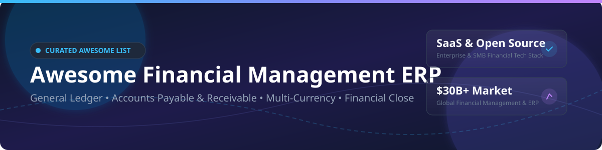

# Awesome Financial Management & ERP 💼💰

  

**A Curated List of Enterprise SaaS Platforms & Open-Source Financial Management ERP Systems.** 🚀  
*Specialized in General Ledger (GL), Accounts Payable & Receivable (AP/AR), Multi-Currency Accounting, Asset Management, and Financial Close Automation.* 📈

---

## 📖 Table of Contents
- [☁️ SaaS & Cloud Financial Management ERP Platforms](#%EF%B8%8F-saas--cloud-financial-management-erp-platforms)
- [🔓 Open-Source Financial Management & ERP Repositories](#-open-source-financial-management--erp-repositories)
- [🤝 How to Contribute](#-how-to-contribute)
- [⭐ Star History](#-star-history)
- [☕ Support & Sponsorship](#-support--sponsorship)
- [⚠️ Disclaimer](#%EF%B8%8F-disclaimer)

---

## ☁️ SaaS & Cloud Financial Management ERP Platforms

> **📊 Market Context & Size**: The global financial management ERP market size is estimated at **~$30 Billion in 2026** and is projected to reach **~$65 Billion by 2032** growing at a CAGR of ~8.5%. The sector is **moderately concentrated** with leading tier-1 enterprise players (**Microsoft**, **SAP**, **Oracle**) holding substantial market share alongside specialized mid-market vendors (**Sage**, **Workday**, **Acumatica**), making it a multi-vendor landscape rather than a winner-take-all market.

Below is a tabular comparison of prominent SaaS and hosted Financial Management & ERP solutions, ordered by company size (Revenue / Market Valuation, Descending):

| Platform 🏢 | Description 📝 | Pricing (Starting Tier) 💵 | Free Tier Limits / Trial ⏳ | Company Size (Revenue / Valuation) 📊 |
|:---|:---|:---|:---|:---|
| **[Microsoft Dynamics 365 Finance](https://dynamics.microsoft.com/en-us/finance/)** | **Enterprise financial management suite.** General ledger, AP/AR, budgeting, cash flow forecasting, and fixed asset management within Microsoft 365 ecosystem. | **$180/user/month** (Dynamics 365 Finance Premium starting tier). | **30-day free trial** with full sandbox access (No perpetual free tier). | **~$281 Billion Revenue** (Microsoft FY2025) |
| **[Oracle NetSuite](https://www.netsuite.com/)** | **Cloud ERP leader with robust financial control.** Multi-subsidiary accounting, revenue recognition, multi-currency consolidation, and automated bank feeds. | **$999/month base license + $99/user/month** (Standard SuiteSuccess tier). | **Free guided product tour** upon request (No free trial or perpetual free tier). | **~$53 Billion Revenue** (Oracle FY2025) |
| **[SAP S/4HANA Finance](https://www.sap.com/products/erp/s4hana.html)** | **Flagship enterprise ERP financial module.** In-memory Universal Journal, real-time multi-dimensional analytics, and automated financial closing. | **~$150,000/year** estimated starting deployment tier for mid-market implementations. | **Free interactive demo environment** via SAP Discovery Center (No perpetual free tier). | **~$35 Billion Revenue** (SAP FY2025) |
| **[Workday Financial Management](https://www.workday.com/en-us/products/financial-management/overview.html)** | **Unified enterprise finance & HCM platform.** Continuous financial reporting, accounting center, adaptive planning, and audit controls. | **~$150,000/year** estimated minimum annual enterprise contract commitment. | **Enterprise interactive demo** upon sales contact (No free trial or perpetual free tier). | **~$8 Billion Revenue** (Workday FY2025) |
| **[Infor CloudSuite Financials](https://www.infor.com/solutions/erp/financials)** | **Industry-focused cloud ERP finance system.** Specialized accounting workflows for healthcare, public sector, distribution, and manufacturing. | **~$100,000/year** estimated enterprise starter licensing tier. | **Guided interactive product demo** (No free trial or perpetual free tier). | **~$3 Billion Revenue** (Infor FY2025) |
| **[Sage Intacct](https://www.sageintacct.com/)** | **Cloud financial management for growth and subscription businesses.** Multi-entity consolidation, revenue recognition, and automated GL workflows. | **$400/month** (billed annually at ~$4,800/year starting tier for core module). | **30-day trial & self-guided product tour** (No perpetual free tier). | **~$2.2 Billion Revenue** (Sage Group FY2025) |
| **[Epicor ERP](https://www.epicor.com/en-us/erp-systems/financial-management/)** | **Industry-tailored financial management.** Global engines for multi-company, multi-currency, AP/AR, and credit management in manufacturing/distribution. | **~$50,000/year** estimated initial deployment subscription tier. | **14-day interactive demo portal** (No perpetual free tier). | **~$1 Billion Revenue** (Epicor FY2025) |
| **[BlackLine](https://www.blackline.com/)** | **Financial close and accounting automation.** Automated account reconciliations, journal entry management, and intercompany hub. | **~$30,000/year** estimated mid-market starter subscription package. | **Custom sandbox trial** for qualified enterprise teams (No perpetual free tier). | **~$600 Million Revenue** (BlackLine FY2025) |
| **[Acumatica](https://www.acumatica.com/)** | **Modern cloud ERP with consumption-based pricing.** Double-entry financials, sub-ledgers, multi-currency, and deferred revenue accounting. | **$1,800/month base platform + $2,000/year per user** (Starting entry package). | **30-day sandbox trial environment** for prospective clients. | **~$500 Million Valuation** (Private Equity) |
| **[FinancialForce (Certinia)](https://certinia.com/products/financial-management/)** | **Native Salesforce platform ERP.** Financial management, billing, professional services automation (PSA), and revenue management in Salesforce CRM. | **$125/user/month** (Minimum 10 user starting requirement). | **Self-guided interactive sandbox tour** (No perpetual free tier). | **~$250 Million Revenue** (Certinia FY2025) |

---

## 🔓 Open-Source Financial Management & ERP Repositories

Below are production-ready **Open-Source Financial Management & ERP** software projects sorted by GitHub star count (Descending):

| Repository 📦 | Description & Key Financial Features ⚙️ | Stars ⭐ |
|:---|:---|:---:|
| **[ERPNext](https://github.com/frappe/erpnext)** | **Leading full-suite open-source ERP.** Enterprise accounting with formula-driven financial reports, custom chart of accounts, multi-currency GL, automated closing stock postings, and IFRS compliance. Built on Frappe Framework (Python/JS). GPL-3.0. |  |
| **[Odoo Community](https://github.com/odoo/odoo)** | **Comprehensive suite of open-source business apps.** Includes basic double-entry accounting, invoicing, vendor bills, payment matching, and bank synchronization. Built on Python/JS. LGPL-3.0. |  |
| **[Dolibarr ERP/CRM](https://github.com/Dolibarr/dolibarr)** | **Modular web-based ERP & CRM for SMBs.** Features general & auxiliary double-entry accounting, tax engines (VAT, GST), bank transaction reconciliation, and e-invoicing (FacturX, Peppol). Built on PHP. GPL-3.0+. |  |
| **[Apache OFBiz](https://github.com/apache/ofbiz)** | **Enterprise automation software suite.** Robust accounting & financial management module with general ledger, asset management, accounts payable/receivable, and financial reporting. Built on Java. Apache-2.0. |  |
| **[FacturaScripts](https://github.com/NeoRazorX/facturascripts)** | **Modern desktop & cloud accounting ERP for SMBs.** Features double-entry accounting, invoice management, tax reporting, stock valuation, and extensible plugin system. Built on PHP 8.1+ & Bootstrap 5. GPL-3.0. |  |
| **[iDempiere](https://github.com/idempiere/idempiere)** | **Enterprise OSGi ERP, CRM & SCM.** Based on Compiere/ADempiere. Features multi-tenant double-entry accounting, multi-currency, multi-organization consolidation, and financial report writers. Built on Java. GPL-2.0+. |  |
| **[PyGtk-Posting](https://github.com/benreu/PyGtk-Posting)** | **Native Linux desktop double-entry ERP.** Features bank reconciliation, budget tracking, financial statements (P&L, balance sheet, net worth), customer billing, vendor POs, and payroll. Built on Python 3, GTK+ 3 & PostgreSQL. GPL-3.0. |  |
| **[IOTA SDK](https://github.com/iota-uz/iota-sdk)** | **Modern Go-based modular ERP software.** Positioned as an open alternative to SAP and Oracle. Includes financial ledger, warehouse, and supply chain modules. Built on Go & GraphQL API. Apache-2.0. |  |
| **[webERP](https://github.com/webERP/webERP)** | **Lightweight web-based accounting & ERP.** International tax engines, AR overdue tracking, bank account reconciliations, multi-currency accounts, and multi-location inventory. Built on PHP. GPL-2.0. |  |
| **[Bizuno](https://github.com/phreesoft/bizuno)** | **Self-hosted accounting & ERP software.** Successor to PhreeBooks. Complete GL, audit trails, compliance logging, multi-warehouse support, and automated shipping/tax integrations. Built on PHP & WordPress plugin. GPL-3.0. |  |
| **[OliveERP](https://github.com/shajeebsh/olive_erp)** | **Modular Django-based ERP system.** Features hierarchical chart of accounts, multi-currency support, double-entry financial ledger, and customizable tax engines. Built on Python 3.11+ & Django 4.2 LTS. MIT. |  |
| **[Open Mercato](https://github.com/open-mercato/open-mercato)** | **Modular ERP with dedicated financial specs.** Country tax plugins, SEPA/ACH payment formatting, bank statement parsers (MT940, CAMT053), and e-invoicing pipelines. Built on TypeScript/Node. MIT. |  |
| **[ERP Microservice](https://github.com/Edison0621/erp-microservice)** | **Cloud-native ERP built with .NET 10 & DDD.** Double-entry general ledger, trial balance generator, AP/AR, asset depreciation, and auto journal postings. Built on C# / .NET. MIT. |  |
| **[FinTrack](https://github.com/FinTrackhq/Fintrack)** | **PHP/Laravel-based financial accounting web application.** Designed as a lightweight open-source alternative to SAP/1C financial modules. MIT. |  |
| **[Viet-ERP](https://github.com/nclamvn/Viet-ERP)** | **Localized open-source ERP for Vietnam & Southeast Asia.** Compliant with VAS TT200 accounting, e-invoice integration (VNPT, Viettel), tax engines, and regional payment gateways. Built on PHP. GPL-3.0. |  |
| **[Lambda ERP](https://pypi.org/project/lambda-erp/)** | **AI-native conversational ERP.** Double-entry general ledger, automated company setup via chat interface, multi-country localization (Germany DATEV SKR03/SKR04, Swiss KMU), and moving-average stock ledger. Built on FastAPI & React. PyPI. |  |

---

## 🤝 How to Contribute

Contributions are very welcome! 💡 Help us keep this financial management ERP collection updated:

1. 🍴 **Fork** this repository.
2. 📝 **Add/Update** entries in `README.md` maintaining table formatting.
3. 🔎 Ensure descriptions are factual, objective, and link directly to official project repositories/documentation.
4. 🚀 **Open a Pull Request** with a summary of changes.

---

## ⭐ Star History

---

## ☕ Support & Sponsorship

If you find this awesome collection of Financial Management & ERP tools helpful, consider supporting the project! 💖

- ⭐ **Star** this repository to increase visibility.
- 🔄 **Share** with finance teams, software architects, and ERP developers.
- ☕ **Sponsor** or buy me a coffee via the [GitHub Sponsor Dashboard](https://github.com/sponsors/ishandutta2007).

---

## ⚠️ Disclaimer

- This list is **community-curated** for informational and research purposes only and does not constitute financial or commercial advice.
- Financial ERP systems process sensitive business ledgers; ensure strict regulatory compliance (GAAP, IFRS, SOX, GDPR) when implementing any solution.
- Pricing details, revenue estimates, and trial limits are subject to change by vendors; always consult vendor representatives for official quotes.
